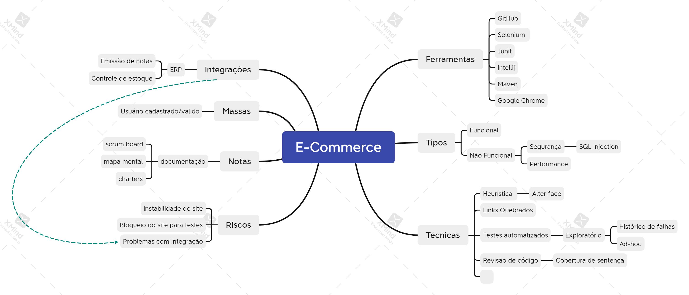

# Automação Web E-commerce

*Automação desenvolvida durante o Programa de Testes e Qualidade de Software de  [Julio de Lima](https://www.juliodelima.com.br/)*

Esse é um repositório que contém a automação de alguns testes Web de um E-commerce para prática de automação web.  Os subtópicos abaixo descrevem algumas decisões tomadas na estruturação do projeto.

## 🤖 Tecnologias Utilizadas

-   [Java](https://www.oracle.com/java/technologies/downloads/)
-   [JUnit](https://mvnrepository.com/artifact/org.junit.jupiter/junit-jupiter-engine/5.8.0-M1)
-  [Selenium Webdriver](https://mvnrepository.com/artifact/org.seleniumhq.selenium/selenium-java/4.1.3)
-  [Maven](https://maven.apache.org/)

## ⚙️ Testes Automatizados

Os testes automatizados estão divididos entre:
a) Testes de carrinho: com adição de produtos, alteração de quantidade e exclusão do mesmo;
b) Testes de enviar página do produto a um amigo: com o preenchimento do formulário de envio;

## 📑 Notas gerais

-   Sempre utilizamos a anotação  _@BeforeEach para realizar as ações de abrir o browser e navegar até o site da lojinha

-   Trabalhamos com o *Page Objects*, criando classes para representar cada página

    -   Armazenamos os métodos utilizados para busca de produto na classe HomePage;
    -   Armazenamos os métodos utilizados para acesso às informações do produto na classe ProdutoPage;
    -   Armazenamos os métodos utilizados nas ações de carrinho na classe CarrinhoPage;
    -   Armazenamos os métodos utilizados para as ações do envio de e-mail na classe PopUpProdutoPage.
-   Nesse projeto fazemos uso do JUnit 5, o que nos dá a possibilidade de usar a anotação  _@DisplayName_  para dar descrições em português para nossos testes.

## Mind Map da estratégia de testes

  

